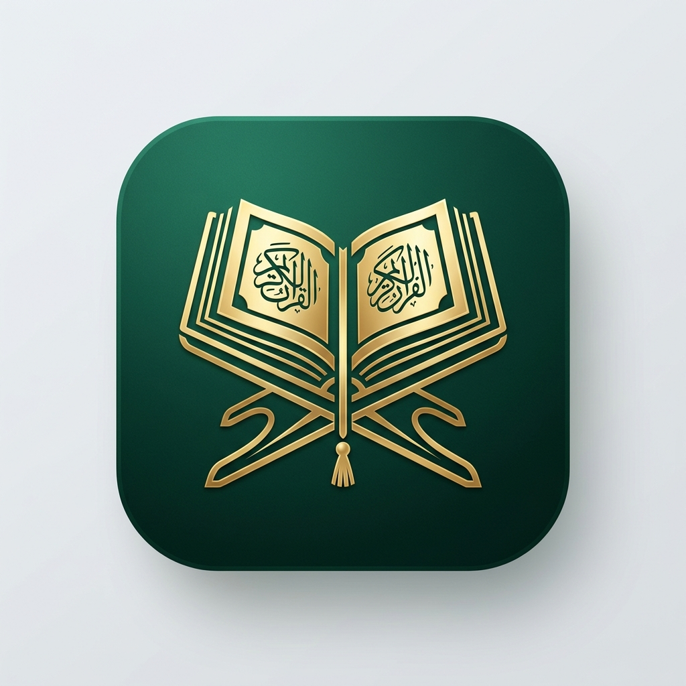

# Ayat - Premium Quran Reader App



**Ayat** is a modern, premium mobile Quran reader application built with Expo and React Native. Designed for spiritual reflection and deep study, it features a beautiful Emerald & Gold aesthetic inspired by classic Islamic design, combined with a seamless, high-performance user interface.

## ✨ Features

- **📖 Interactive Reader**: High-quality Uthmani script with adjustable display and side-by-side translations.
- **🔊 Audio Recitation**: Stream beautiful recitations from world-renowned Qaris with per-verse highlighting and looping.
- **🔖 Bookmarks & Reflections**: Save your favorite ayahs and record personal study notes directly within the app.
- **🔍 Powerful Search**: Instantly find any verse across Arabic text, transliterations, and multiple translations.
- **🌙 Multiple Themes**: Choose between Light, Dark (Emerald), and Sepia modes for a comfortable reading experience at any time.
- **💾 Offline First**: Built-in SQLite database ensures your bookmarks and progress are saved locally even without internet.

## 🛠️ Tech Stack

- **Framework**: [Expo](https://expo.dev/) (SDK 54)
- **Routing**: [Expo Router](https://docs.expo.dev/router/introduction/)
- **Database**: [Expo SQLite](https://docs.expo.dev/versions/latest/sdk/sqlite/)
- **Audio**: [Expo AV](https://docs.expo.dev/versions/latest/sdk/av/)
- **Icons**: [Lucide React Native](https://lucide.dev/)
- **Animation**: [React Native Reanimated](https://docs.swmansion.com/react-native-reanimated/)

## 🚀 Getting Started

### Prerequisites

- Node.js (v18 or later)
- Expo Go app on your mobile device (to preview)

### Installation

1. Clone the repository:
   ```bash
   git clone https://github.com/MohammedArmaan-ui/Ayat.git
   ```

2. Install dependencies:
   ```bash
   npm install
   ```

3. Start the development server:
   ```bash
   npx expo start
   ```

4. Scan the QR code with Expo Go (Android) or the Camera app (iOS) to run the app.

## 📁 Project Structure

- `app/`: Expo Router directory (Screens and Navigation).
- `src/components/`: Reusable UI widgets (AyahCard, AudioController, etc.).
- `src/services/`: Business logic (Quran data, Audio, Storage).
- `src/database/`: SQLite initialization and migrations.
- `src/theme/`: Color palettes and styling constants.

## 📝 License

This project is for educational and spiritual benefit. Please respect the Quranic content and Islamic etiquettes when using or modifying this application.

---
Created with ❤️ by Mohammed Armaan